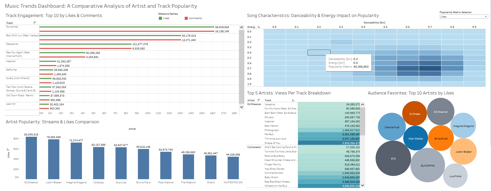

# Analysis of Song Popularity on Spotify and YouTube

## Project Overview

This project involves a comprehensive analysis of song popularity on two major digital platforms: Spotify and YouTube. Utilizing a rich dataset from Kaggle, the project aims to decipher the correlation between various musical characteristics and the online engagement metrics of songs. The insights derived from this analysis are anticipated to be valuable for artists, producers, and marketers in the music industry.

## Objectives

1. **Understand the Relationship Between Spotify's Audio Features and Song Popularity**: Exploring how features like danceability, energy, and loudness correlate with a song's popularity on Spotify and YouTube.
2. **Identify Patterns and Trends in Music Consumption and Audience Preferences**: Analyzing audience consumption habits and preferences in musical characteristics.
3. **Provide Data-Driven Insights for Industry Stakeholders**: Assisting industry players in making informed decisions based on audience preferences and song characteristics.

## Dataset Description

The dataset includes the following variables for each song:

- **Track**: Name of the song as listed on Spotify.
- **Artist**: The artist or band that performed the song.
- **Url_spotify**: The URL link to the song on Spotify.
- **Album**: The album in which the song is featured on Spotify.
- **Album_type**: Indicates if the song is released as a single or is part of an album.
- **Uri**: A unique Spotify URI for accessing the song.
- **Danceability**: A measure of how suitable a track is for dancing, ranging from 0.0 (least danceable) to 1.0 (most danceable).
- **Energy**: A perceptual measure of intensity and activity, rated between 0.0 and 1.0.
- **Key**: The key of the track, represented in standard Pitch Class notation.
- **Loudness**: The overall loudness of a track in decibels (dB).
- **Speechiness**: Measures the presence of spoken words in a track, with higher values indicating more speech.
- **Acousticness**: A confidence measure of whether the track is acoustic, ranging from 0.0 to 1.0.
- **Instrumentalness**: Predicts whether a track does not contain vocals, with values closer to 1.0 indicating instrumental tracks.
- **Liveness**: Detects the presence of an audience in the recording.
- **Valence**: A measure from 0.0 to 1.0 describing the musical positiveness conveyed by a track.
- **Tempo**: The overall estimated tempo of a track in beats per minute (BPM).
- **Duration_ms**: The duration of the track in milliseconds.
- **Stream**: The number of streams of the song on Spotify.
- **Url_youtube**: The URL of the video linked to the song on YouTube.
- **Title**: Title of the YouTube video.
- **Channel**: Name of the channel that published the YouTube video.
- **Views**: Number of views on YouTube.
- **Likes**: Number of likes on the YouTube video.
- **Comments**: Number of comments on the YouTube video.
- **Description**: Description of the YouTube video.
- **Licensed**: Indicates if the video is licensed content.
- **official_video**: A boolean value indicating if the video is the official music video of the song.

## Tools and Technologies Used

- **Python**: For data cleaning, manipulation, and exploratory data analysis.
- **SQL**: For data querying and manipulation.
- **Jupyter Notebook**: For conducting and presenting data analysis.
- **Pandas & Matplotlib**: For data processing and visualization.
- **Tableau Online**: For Visualization.
  
- ## Repository Structure

- [`.ipynb_checkpoints`](./.ipynb_checkpoints): Contains checkpoints of Jupyter notebooks.
- [`EDA Analysis pandas.py`](./EDA%20Analysis%20pandas.py): Python script for Exploratory Data Analysis using Pandas.
- [`EDA Analysis SQL.sql`](./EDA%20Analysis%20SQL.sql): SQL script for Exploratory Data Analysis.
- [`pic1.png`](./pic1.png), [`pic2.png`](./pic2.png), [`pic3.png`](./pic3.png): Descriptives Images.
- [`Spotify_Youtube.csv`](./Spotify_Youtube.csv): Combined dataset of Spotify and YouTube metrics.
- [`Youtube Cleaned data.xlsx`](./Youtube%20Cleaned%20data.xlsx): Cleaned dataset.
- [`Youtube.ipynb`](./Youtube.ipynb): Jupyter notebook for YouTube data analysis.

- ## Dashboard
Tableau online

)

